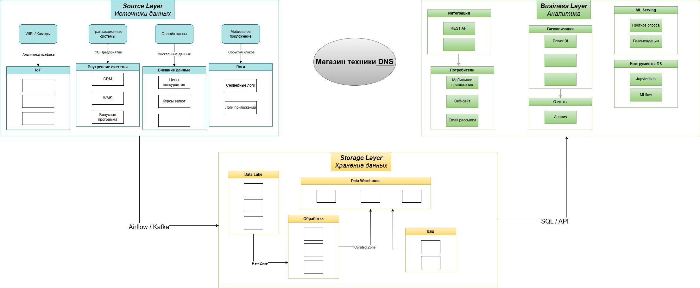

# HOMEWORK for module 1.

## *Tasks labs 1*

***

- [x] Установка GitHub

---

- [x] Архитектура Аналитического Решения

Необходимо нарисовать верхнеуровневую архитектуру аналитического решения. 

- Необходимо использовать:

  - Source Layer - слой источников данных

  - Storage Layer - слой хранения данных

  - Business Layer - слой для доступа к данным бизнес пользователей

## Архитектура системы

*[Редактировать схему](images/DE-101_1.drawio)*

---

- [ ] Аналитика в Excel